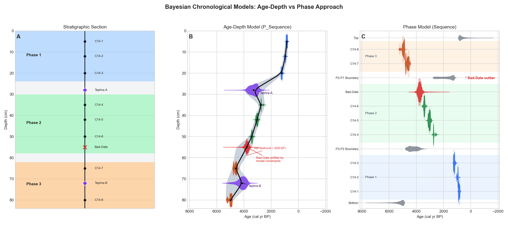

VARG-Tools writes OxCal code. It does not run OxCal or validate the resulting posterior model. Choose the model from the scientific structure of the problem, then review both the generated code and the OxCal output.

## Choose the model

| Scientific structure | VARG-Tools tab | What the code represents |
|:--|:--|:--|
| A continuous ordered sediment record with depth | **Age-Depth Model** | An OxCal `P_Sequence` with dated and estimated horizons |
| Dates grouped before, during, or after an event, without a continuous depth model | **Phase Model** | Ordered phases and event boundaries |
| Two existing model snippets sharing accepted tephra horizons | **Model Linker** | Separate models constrained to common event ages |



## Age-Depth Model

**Input:** a chronology CSV or Excel table. Download the current template from the tab rather than repurposing the geochemistry table.

| Field | Meaning |
|:--|:--|
| `Name` | Unique sample, event, or boundary identifier |
| `Age` and `Uncertainty` | Central age and 1-sigma error, or half-range for uniform constraints |
| `Depth` | Stratigraphic coordinate in one consistent unit |
| `Type` | `R_Date`, `R_F14C`, `Date`, `Tephra`, `Date_CE`, `Tephra_CE`, or `Boundary` |
| `Unc_Type` | Optional `N` for normal or `U` for uniform uncertainty |

Use `R_Date` for conventional radiocarbon BP, `R_F14C` for fraction modern, `Date` or `Tephra` for calendar BP, and the `_CE` types for CE years. A blank tephra age can be estimated where the model supports it. Do not mix age scales under one type.

### Workflow

1. Upload the table and confirm that names, types, ages, uncertainties, and depths were parsed correctly.
2. Select the primary calibration curve and, where needed, the bomb curve.
3. Set the depth unit. In generated `P_Sequence` code, centimetres use base `k0 = 1` and metres use `k0 = 100`.
4. Review the automatically calculated interpolation rate. It is based on dated-level density across the modelled range and can be overridden.
5. Add only the outlier models justified by the dated material and study design.
6. Select **Generate OxCal Code**, read the code, and copy it into OxCal.

**Checkpoint:** every input row appears once with the intended type, depth, uncertainty, calibration curve, and outlier treatment. Estimated events have no invented observed age.

## Phase Model

**Input:** rows assigned to `Before`, `During`, or `After` groups for each named event. The phase template includes event name, phase, sample name, date type, age, uncertainty, optional uncertainty type, and optional outlier model.

Use this route when the ordering of groups is defensible but continuous accumulation with depth is not being modelled. Choose whether the event is represented as a boundary or within a phase, and use optional `Tau_Boundary` terms only when their waiting-time assumption is appropriate.

**Checkpoint:** the generated sequence preserves the intended before/during/after order and does not imply continuous deposition that the data cannot support.

## Model Linker

**Input:** OxCal code for Model A, OxCal code for Model B, and a tie table with a tie name plus the matching event name in each model. Tie rows can be pasted as comma- or tab-separated text or imported from the current Stratigraphic Correlation session.

The linker uses OxCal equality constraints, for example:

```oxcal
Date("Tie_1");
Date("Record_A_event", "=Tie_1");
Date("Record_B_event", "=Tie_1");
```

This is not a `Combine()` operation. Both events are constrained to the same modelled date anchor.

1. Confirm that event names exactly match the two code snippets.
2. Import or paste the working ties and leave only defensible ties active.
3. Select **Link Models**.
4. Search the generated code for every tie declaration and linked event before running it.

Wrong ties transfer error between records. Compare the linked result with unlinked models and rerun without uncertain ties when the scientific conclusion might depend on them.

## Review after running OxCal

Do not reduce model review to a single agreement-index threshold, especially when an outlier model is used. Check:

- syntax errors, duplicate names, zero distributions, and convergence warnings;
- posterior order and whether age-depth behaviour matches the stratigraphy;
- prior-to-posterior shifts and the behaviour of designated outliers;
- whether linked constraints create implausible changes near a tie;
- sensitivity to uncertain correlations, calibration choices, and model structure;
- geological plausibility of interpolated and extrapolated ages.

Save the exact OxCal input and exported output with the source chronology table. The code is part of the analytical record.
