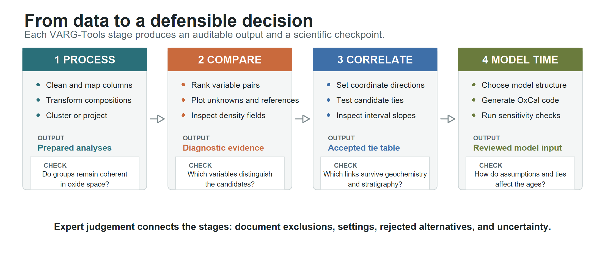

VARG-Tools supports a connected tephrochronology workflow: prepare glass-geochemical data, identify useful comparisons, align stratigraphic records, and generate OxCal code. The app automates repetitive calculations, but the user remains responsible for deciding whether populations, correlations, and chronological constraints are geologically defensible.

## Choose a route

| I want to... | Start here | Main result |
|:--|:--|:--|
| Check that the app and my data work | [First successful run](getting-started.qmd) | A processed table and a VARG26 projection |
| Prepare, cluster, or project geochemistry | [Processing](processing.qmd) | Appended transformation, GMM, UMAP, and population columns |
| Find discriminating variables or make comparison plots | [Visualization](visualization.qmd#variable-pair-finder) | Ranked variable pairs or an exportable plot |
| Align two depth or age series | [Stratigraphic correlation](visualization.qmd#stratigraphic-correlation) | Tie table, warped coordinates, and chronology-ready mappings |
| Build chronology code | [Chronology](chronology.qmd) | Reviewed OxCal code for a sequence, phase, or linked model |
| Resolve an error | [Troubleshooting](troubleshooting.qmd) | A symptom-based check and next action |

You do not need to complete every module. Start with the task that answers your scientific question and carry only the outputs you need into the next stage.

## Four operating rules

1. **Keep the original columns.** VARG-Tools appends derived columns rather than replacing the uploaded values. Export before leaving a session.
2. **Treat models as evidence, not decisions.** A cluster, nearby UMAP position, density field, or visually aligned warp does not establish a correlation by itself.
3. **Check results in the original variables and stratigraphy.** Automated summaries should be reconciled with oxide plots, sample context, stratigraphic order, and chronological evidence.
4. **Review generated OxCal code.** VARG-Tools writes code but does not run OxCal or determine whether the model assumptions are appropriate.

## Hosted-app sessions

The hosted app requires sign-in. A session closes after one hour without activity; an active long-running analysis suspends that idle countdown. Save a `.varg` project where supported and export important tables before closing the application.

This guide is the operational reference for the current interface. The VARG-Tools paper and supplement provide the scientific rationale, validation, and version-locked demonstration analyses.
