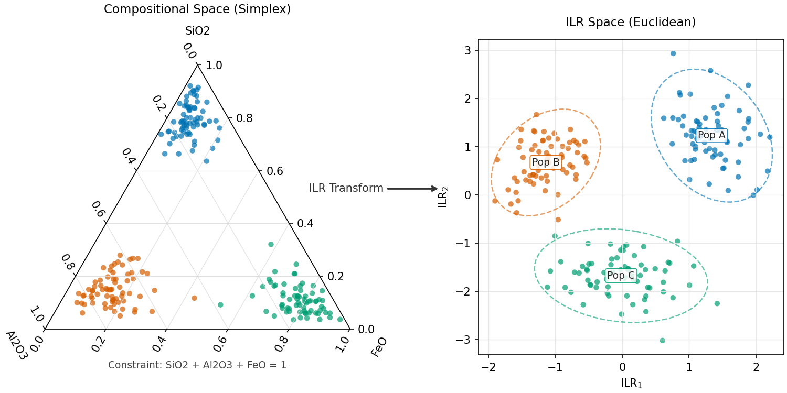
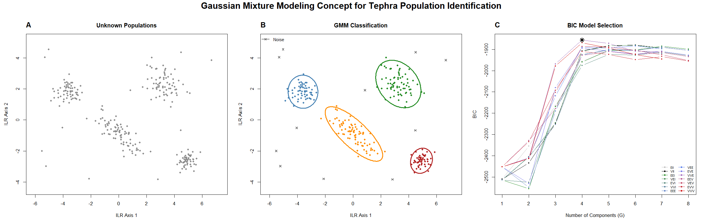

**Use this module when:** you need a traceable table for compositional analysis, clustering, UMAP projection, or expert population labels.

**Input:** CSV or Excel with one glass analysis per row.

**Result:** the original columns plus selected normalized, imputed, log-ratio, GMM, UMAP, and population columns.

## The reliable path

| Step | Action | Stop and check |
|:--|:--|:--|
| **1. Import Data** | Load a CSV or Excel sheet and identify compositional and metadata columns. | Oxides are numeric; sample and point identifiers survived import. |
| **2. Preprocessing** | Select the composition, decide whether to impute, and apply an ILR or CLR transform. | Generated columns contain finite values and excluded rows remain excluded. |
| **3. Clustering (GMM)** | Choose the prepared data and a plausible cluster range, then run GMM. | The selected solution is stable enough to inspect in oxide space. |
| **4. Projection (UMAP)** | Project into VARG26 or create a dataset-specific UMAP. | UMAP is used as a similarity view, not a correlation verdict. |
| **5. Define Populations** | Initialize labels, inspect points, and assign meaningful population names. | Labels agree with detailed geochemistry and sample context. |
| **6. Export** | Review the preview, then download CSV or XLSX. | The exported table contains the original and required generated columns. |

Only Steps 1 and 2 are needed for a prepared compositional table. GMM, UMAP, and population definition are optional analyses.

## Preparing compositional data

Glass-geochemical oxide values are parts of a whole. Euclidean analysis of raw percentages can create misleading distances and correlations, so VARG-Tools can normalize and move the data into log-ratio coordinates.

Three choices matter:

1. **Which columns form the composition?** Select analytes that are comparable across the rows being analysed. Keep identifiers, depths, ages, and other metadata as non-compositional columns.
2. **Does imputation have a defensible meaning?** **Impute Zeros/Missing** replaces zeros and missing entries with the regression-based compositional methods implemented through `robCompositions::impCoda()`. Use it when those entries represent unmeasured or below-detection analytes that must be harmonized for a shared analysis. Do not use it to conceal poor totals or invalid analyses.
3. **Which transform fits the next method?** Use **ILR (Pivot Coordinates)** for GMM, custom UMAP, and compatibility with VARG26. Use `SiO2` as the pivot when matching the VARG26 convention. CLR is useful for exploratory views but its singular covariance can cause GMM failure.

The fixed VARG26 projection expects `SiO2`, `TiO2`, `Al2O3`, `FeO`, `MnO`, `MgO`, `CaO`, `Na2O`, and `K2O`, with total Fe expressed as FeO. Verify the detected mappings. VARG26 applies the training-compatible preparation internally; manually prepared columns remain useful for the other modules and for auditing the data.

## Interpreting GMM output

GMM proposes multivariate groups. It does not determine eruption identity or geological equivalence.

- **BIC:** `mclust` uses a convention in which higher BIC is better. Inspect the full trace, not only the winning label.
- **Detect Outliers:** when enabled, noise initialization can assign poorly fitting analyses to cluster `0`. Turning it off forces points into fitted clusters.
- **Stabilize Estimation:** enable the conjugate prior when model traces are incomplete or fits fail. Treat a materially changed solution as a new result requiring inspection.
- **Include Uncertainty/Probabilities:** adds membership probabilities and uncertainty columns. Enable it when ambiguous membership matters; otherwise it can make exports unnecessarily wide.

Compare the proposed groups in original oxide and diagnostic bivariate plots. Merge, split, rename, or reject clusters only with an explicit geological reason.

## Interpreting UMAP output

**VARG26 projection** places compatible analyses into a fixed regional reference space. Use it to screen possible affinities and select detailed comparisons. Proximity is not proof of provenance or correlation.

**Custom UMAP** explores structure within the uploaded dataset. Neighbours controls local versus broader structure; minimum distance controls how tightly points pack. Orientation, scale, and axis signs can change between independently trained models.

Saved custom UMAP models record the prepared numeric columns and their order. Projection data must supply those same prepared columns. The saved model does not re-estimate imputation or other preprocessing from the new batch; incomplete rows are skipped.

## Population labels and export

Population definition is the interpretive step. Initialize from an existing column when useful, then use filters and lasso selection to assign or revise labels. Preserve an `Unassigned` category for points that are not defensibly grouped.

The Processing export is the scientific handoff. CSV contains the working table; XLSX also contains a column dictionary. A `.varg` project saves supported Processing, GMM, UMAP, and population state, but it does not replace exported data and does not preserve every Visualization or Chronology control.

## Checks before continuing

- Original values and identifiers are still present.
- Excluded rows were not used in fitted analyses.
- Imputation was limited to columns and rows where it is scientifically defensible.
- GMM groups were checked outside transformed space.
- VARG26 or UMAP proximity is described as similarity, not proof.
- Population labels document expert decisions rather than merely renaming cluster numbers.
