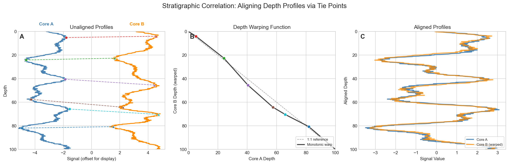

Visualization contains three separate tools. Use the Variable Pair Finder to identify informative bivariate views, Custom Scatter Plots to examine and export those views, and Stratigraphic Correlation to align two ordered records.

## Variable Pair Finder

**Decision supported:** which pair of supplied variables best distinguishes groups already defined by the user?

1. Use the current processed data or upload a table.
2. Choose a categorical group label and at least two numeric predictors.
3. Leave **Create derived features (ratios & sums)** off for the first run.
4. Keep a recorded random seed and choose neighbours (`k`; default 3).
5. Review the workload estimate, then select **Find Best Variable Pairs**.
6. Select a ranked row to inspect its scatter plot; export the table for a reproducible record.

The tool evaluates every candidate pair with a 10-fold cross-validated k-nearest-neighbours classifier. **Kappa** is the primary ranking and accounts for chance agreement; **Accuracy** is the fraction of correct classifications. Higher values indicate better discrimination under this analysis, not a unique or causal geochemical relationship.

The finder retains complete, finite, non-zero rows and does not impute within this module. It then centers and scales each candidate variable pair before 10-fold KNN evaluation, so variables measured on different numerical ranges contribute comparably to distance. Prepare zeros or unmeasured analytes in Processing before the run. Derived ratios and sums are opt-in because they expand the search rapidly and can generate redundant variables.

**Check before using a top pair:** plot the data, identify the samples driving separation, and ask whether repeated point analyses make the apparent performance optimistic. Cross-validation of rows is not independent validation of new tephra samples.

## Custom Scatter Plots

**Decision supported:** do unknown and candidate reference populations remain distinguishable in interpretable variables?

Choose the X and Y variables, filter the displayed data, and set colours or shapes from meaningful grouping columns. A Variable Pair Finder result is a useful starting view, not a required input. TAS fields, labels, axis reversal, and export dimensions are optional presentation controls.

### Reference density fields

VARG26 or uploaded reference populations can be shown as highest-density-region (HDR) fields.

| Control | Interpretation |
|:--|:--|
| **Density estimator** | KDE gives a smooth field. Frequency polygon and histogram use binned density estimates. |
| **Envelope Size** | Probability content of the HDR. Larger values include more of the fitted reference density. |
| **Smoothness** | KDE bandwidth adjustment. It is shown only for KDE. |
| **Bins** | Resolution of frequency-polygon or histogram estimates. Increase it when fields are too coarse, but avoid fragmenting sparse groups. |

Groups with fewer than three usable observations, or with no spread on either axis, are omitted with a warning. An HDR is a description of the selected reference distribution. It is not the probability that an unknown belongs to that source or eruption.

When VARG26 data are visible, use the source list shown by the app. Cite the underlying datasets as well as VARG-Tools. Export PNG for ordinary raster use, PDF or SVG for editable publication graphics, and CSV to preserve the plotted values.

## Stratigraphic Correlation

**Decision supported:** which proposed links provide a defensible monotonic alignment between two records?

### Input and setup

The table must contain a core/site identifier, sample identifier, stratigraphic coordinate, and numeric correlation variable. The correlation variable might be a 1D UMAP coordinate, oxide, or ratio. VARG-Tools plots the supplied values; it does not rescale the correlation variable automatically.

1. Map the four columns and select **Validate Columns**.
2. Choose the **Reference** record, which remains fixed, and the **Target** record, which will be warped.
3. Set each record to **Increase downward (depth/BP)** or **Increase upward (CE/elevation)**. This allows records with opposite numerical directions to be plotted and ordered correctly.
4. Use **Initial Alignment** to inspect the uploaded coordinates.

If the records occupy very different vertical ranges, use **Affine Preview**. **Match ranges** gives a quick display transform; **Manual** applies a positive scale magnitude and shift. This preview does not alter uploaded coordinates, tie depths, the fitted warp, or exports. **Target X Offset** shifts the target correlation-variable display in the initial, preview, and warped views without changing the values used in exports.

For dense or long records, reduce core line width and point size, hide the point cloud, or set plot height to 1.5x or 2x.

### Add and test ties

Add ties by choosing samples in the table, or select the crosshairs button and then click one Reference point followed by one Target point. Give each tie a recognizable name and leave **Use** on only for accepted working links.

Select **Apply Warping Model**, then inspect three things:

- **Warped Alignment:** do features align without implausible compression or expansion?
- **Warp Fit:** is the mapping monotonic and geologically plausible between and beyond ties?
- **Tie Diagnostics:** when each tie is omitted in turn, how far is it from the position predicted by the remaining ties?

The warp is an exact-anchor, monotonic, piecewise-linear mapping through every active tie. It interpolates linearly between adjacent ties and extends the nearest tied slope beyond the outer ties. The extrapolated ends therefore carry more structural uncertainty than the tied interval.

Leave-one-out residuals identify ties that exert stronger local leverage on the alignment. They are reported in reference-axis units and do not, by themselves, show that a correlation is wrong. Predictions for the first and last ties use extrapolation and are less constrained than predictions for interior ties. Evaluate these diagnostics together with interval slopes, compression or expansion, feature alignment, detailed geochemistry, stratigraphic order, independent ages, and site context.

### Export

- **Warped Data:** target rows with warped stratigraphic coordinates.
- **Tie Points:** the auditable link table.
- **Copy JSON for Chronology:** current ties formatted for the Chronology Model Linker in the same session.

The correlation tool does not generate linked OxCal code. That step belongs in [Chronology](chronology.qmd).
